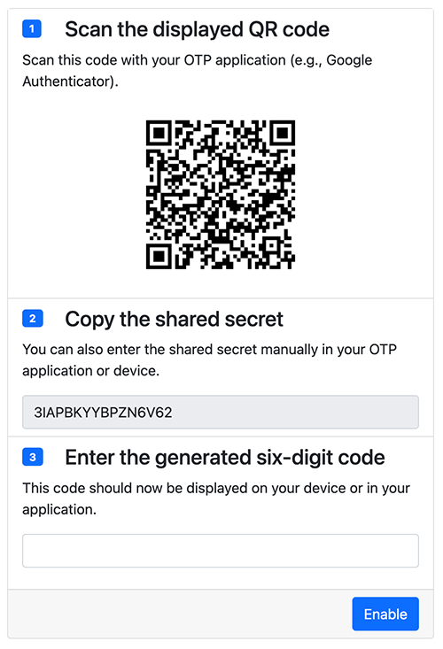

.. include:: ../Includes.rst.txt
.. _introduction:

Introduction
============

.. _what-it-does:

What does it do?
----------------

This extension adds support for Multi-Factor Authentication (MFA) to TYPO3's
Frontend.

It supports TYPO3 v10 LTS, v11 LTS and v12 LTS.

MFA can be configured by editing a ``fe_users`` record in the TYPO3 Backend. A
Frontend plugin is provided to allow users to configure their MFA settings
themselves.

.. note::

   This extension has been initially inspired by
   `[codeFareith] Google Authenticator <https://extensions.typo3.org/extension/cf_google_authenticator>`__
   but it has been rewritten and extended as that former extension was not
   actively maintained anymore. Thanks to the original author
   Robin "codeFareith" von den Bergen for the inspiration!

.. _screenshots:

Screenshots
-----------

   Configuration of the MFA settings for a Frontend user

.. _privacy:

Privacy
-------

This extension does not store any personal data. It only stores the secret used
by the configured MFA method in the ``fe_users`` table (field ``mfa_frontend``).

When configuring TOTP, a QR code is generated to let the user configure their
Authenticator app.

.. _support:

Support
-------

In case you need help to configure this extension, please ask for free support
in `TYPO3 Slack <https://typo3.slack.com/>`_ or contact the maintainer for paid
support.
