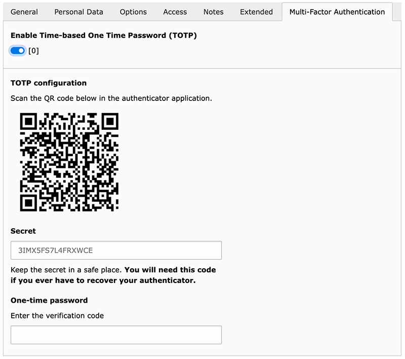

.. include:: ../Includes.rst.txt
.. _usage:

Usage
=====

When you edit a Frontend User (``fe_users``), you will see a new tab called
"Multi-Factor Authentication". There, you can enable MFA for the user by
toggling the switch and following the instructions:

Once you have enabled MFA for a user, you will have to enter a valid TOTP code
together with toggling off the switch to disable MFA again.

.. _usage-plugin-setup:

Plugin "Two-Factor Authentication (2FA) Setup"
----------------------------------------------

.. _usage-plugin-setup-typoscript:

TypoScript Configuration
^^^^^^^^^^^^^^^^^^^^^^^^

Please start by editing your Template record to include the TypoScript template
provided by this extension.

You can do so like that:

1. Open the Template module within the Web section.
2. Select your root page template (usually the one with the world icon).
3. Make sure you are on the "Info/Modify" view (top selector).
4. Click on the button "Edit the whole template record".
5. Switch to tab "Includes".
6. Include "MFA Frontend (mfa_frontend)" within the "Include static (from
   extensions)" section.

.. hint::

   If you already customized the look of the Frontend login plugin, you will
   probably need to adjust your own template with the one provided by this
   extension and drop the override suggested by this extension by adding this
   to your TypoScript setup:

   .. code:: typoscript

      plugin.tx_felogin_login.view.templateRootPaths.11 >

   or ensure that your own template has a higher index definition than "11".

.. _usage-plugin-setup-ce:

Insert the Plugin
^^^^^^^^^^^^^^^^^

1. Open the page where you want to insert the plugin.
2. Click the button to add a content to your page.
3. Choose "General Plugin" from the list of content elements (usually on the tab
   "Plugins").
4. Switch to the tab "Plugin" and choose "Two-Factor Authentication (2FA) Setup"
   from the list of plugins:

   .. image:: Images/insert-plugin.png
      :alt: Choosing the plugin to insert

5. Add access restrictions (typically to logged-in users only) to the plugin or
   the page itself if necessary.

Now visit that page in the Frontend and you should see the plugin:

.. image:: Images/plugin-setup.png
   :alt: Configuration plugin for an logged-in user
